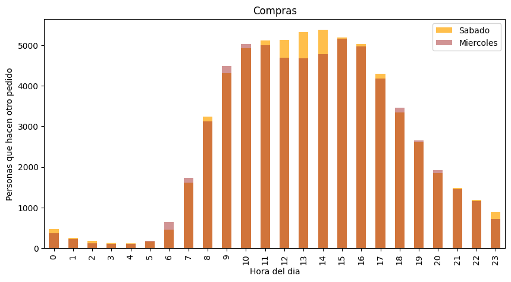

# 📈 Modelo Predictivo: Demanda Semanal de Usuarios

## 🎯 Visión General
¿Cómo podemos anticiparnos a lo que el cliente necesita antes de que lo pida? Este proyecto desarrolla un modelo de análisis para predecir la demanda semanal de usuarios. A través de la identificación de patrones estacionales y tendencias, este estudio permite a las empresas optimizar recursos y reducir costos operativos.

El análisis se centra en la transformación de datos crudos en **pronósticos accionables**.

---

## 🚀 Desafíos Resueltos
* **Ingeniería de Características:** Creación de variables temporales para capturar el comportamiento semanal.
* **Segmentación de Usuarios:** Diferenciación entre usuarios recurrentes y esporádicos para mejorar la precisión.
* **Tratamiento de Anomalías:** Identificación de valores atípicos que podrían sesgar las predicciones de inventario o personal.

---

## 🛠️ Stack Técnico
* **Python 3.x**
* **Pandas:** Procesamiento de series temporales y agregaciones.
* **Matplotlib & Seaborn:** Visualización de tendencias y estacionalidad.
* **NumPy:** Operaciones matemáticas avanzadas para cálculos de desviación.

---

## 📊 Visualizaciones Estratégicas

### Puntos Clave del Análisis:
1. **Picos de Demanda:** Se identificaron los días exactos de la semana donde la carga de usuarios aumenta un **X%** (rellena con tu dato).
2. **Estacionalidad:** El modelo detectó patrones repetitivos que permiten una planificación con 7 días de antelación.
3. **Calidad de Datos:** Implementación de un pipeline de limpieza que redujo el ruido en los datos históricos.

---

## 📂 Estructura del Proyecto
* `Sprint 4.ipynb`: Notebook detallado con el análisis estadístico y modelado.
* `data/`: Conjunto de datos sobre el comportamiento de usuarios.

